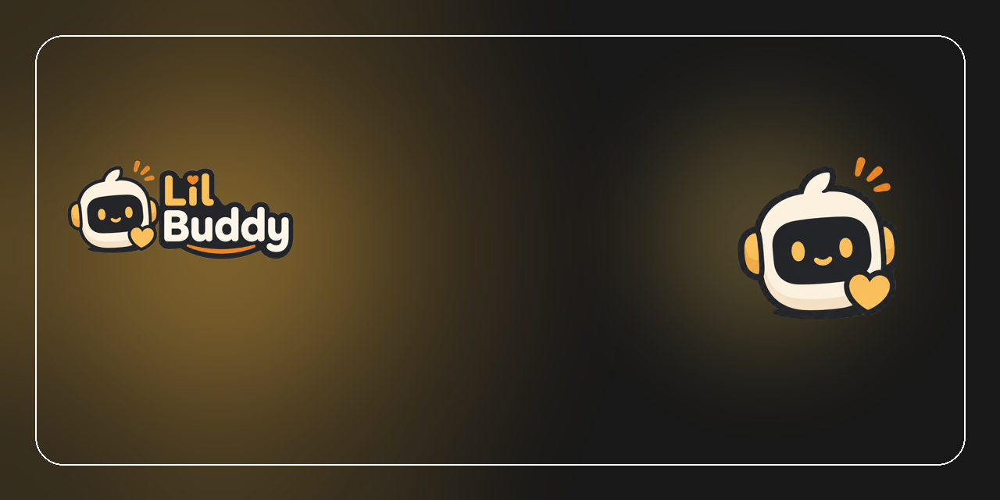

<p align="center">

  

</p>

<h1 align="center">Lil Buddy</h1>

<p align="center">

  A local-first desktop AI helper for planning, search, writing, learning, light coding, and everyday work.

</p>

<p align="center">

  

  

  

  

</p>

<p align="center">

  

</p>

---

## What is Lil Buddy?

**Lil Buddy** is a warm, local-first desktop AI helper built for people who want a personal assistant they can understand, customize, and run from their own machine.

It is not mainly a coding app. Coding help is one ability. Lil Buddy is meant to help with:

- planning and organizing ideas
- searching and researching
- writing and rewriting
- learning and brainstorming
- managing expert/persona workflows
- light coding and project assistance
- optional Telegram access for remote chatting

> Status: **Developer Preview**  
> Lil Buddy is experimental. Expect rough edges, rapid changes, and active polishing.

## Features

- Local-first AI helper experience
- Expert/persona switching
- Chat sessions and tabs
- Workspace-aware helpers
- Companion character animations
- Theme and companion customization
- Provider/CLI integration
- Telegram gateway support
- System tray controls
- Planning, writing, searching, light coding, and everyday helper workflows

## Why local-first?

Lil Buddy is designed to keep the desktop app useful even without a hosted backend. You choose your providers and workflows.

## Developer Preview expectations

This release is for early users, builders, and testers.

Please expect:

- occasional bugs
- UI polish issues
- platform-specific quirks
- changing settings and storage formats
- incomplete documentation

## Licensing

The source code is licensed under MIT. See `LICENSE`.

The Lil Buddy logo, companion art, animation assets, premium packs, screenshots, and brand identity are covered separately. See `ASSET_LICENSE.md`.

## Safety note

Lil Buddy can connect to local CLI tools and workspaces. Review commands carefully and avoid giving it access to sensitive folders until you understand how your provider and workspace settings are configured.

## Getting started

```bash
npm install
cp .env.example .env
npm run tauri dev
```

### Telegram environment variables

Lil Buddy can load Telegram credentials from `.env` or process environment variables. Saved in-app settings take precedence when present; blank settings fields fall back to environment values.

Supported variables:

```bash
LIL_BUDDY_TELEGRAM_BOT_TOKEN=
LIL_BUDDY_TELEGRAM_WEBHOOK_PUBLIC_URL=
LIL_BUDDY_TELEGRAM_WEBHOOK_PATH_SECRET=
LIL_BUDDY_TELEGRAM_WEBHOOK_SECRET=
LIL_BUDDY_TELEGRAM_ALLOWED_CHAT_ID=
```

Use `.env.example` as the template and keep real secrets only in `.env`.

Linux/Wayland fallback options:

```bash
npm run tauri:wayland-safe
npm run tauri:x11
```

## Support the project

If Lil Buddy helps you, consider supporting development through GitHub Sponsors, Ko-fi, or Patreon once those links are added.

See `.github/FUNDING.yml`.

## Roadmap

See `ROADMAP.md`.

## Contributing

See `CONTRIBUTING.md`.

## Security

See `SECURITY.md`.

## Installing packaged builds

For regular users, download the installer for your operating system from GitHub Releases.

Recommended release files:

```txt
Windows: .exe setup installer
macOS: .dmg
Linux: .AppImage, .deb, or .rpm
```

Build and packaging notes are in `docs/PACKAGING.md`.